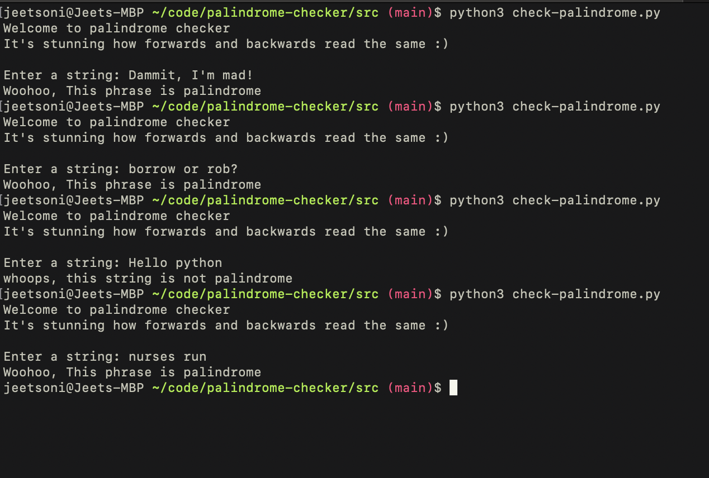

# palindrome checker
*Author: Jeet Soni*

*Date: 08/11/2023*

### **Description**

OOOhh, It's shocking how a phrase from the front and back reads the same. I made this little program to check the a phrase is palindrome or not. 

### **How does it work?**

I created one empty lists. I asked user to input the string and make everything lower(). To make sure the string doesn't have any special characters if the user enters a phrase with one, I used regular expression to removes all the special character from the string. I also removed all the spaces that user might enter using replace() function. This will keep the program from throwing any errors and the program will run smoothly. I converted the final clean phrase to a list.

I used a for loop with reversed() function and reverse the final phrase list characters. I compared two lists together. If they both lists are exactly the same then it's a palindrome else it's not. 

### **Does it work?**

### **Conclusion**

Well, This was a fun little program to create. I learned more about regular expressions and lists. 

Open for suggestions

Jeet

